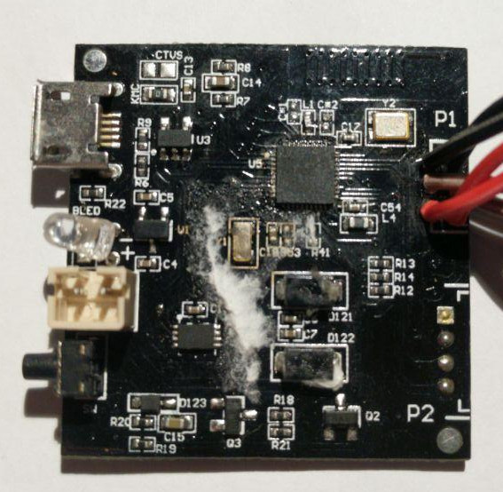

# Hackulele

I was bored abroad and missed my ukulele to just occupy my hands. Turned out some other dude was selling one of his [Populele](https://popuband.com/products/populele-with-accessory) for pretty cheap, so I bought it to have a travel uke, and also because OMG BLINKING LIGHTS.

## Unboxing

Haha. No.

## Playing

You can make pleasant noises with it. Just exercise & train for a couple years or more.

## App

The point of the whole thing is you're supposed to use a bloated, kind of ugly and slow-ass app to connect to your uke over bluetooth, so it can send it commands to light the blinky lights.

The app tries to gamify the learning process, has songbooks and stuff.

As all "SMART" things go, everybody on the [app's page](https://play.google.com/store/apps/details?id=com.gt.populeleinternational&hl=en&showAllReviews=true) complains about shitty bluetooth connection, bugs, etc. The whole thing is just absolutely frustrating to use and barely works as expected. Also probably comes with free remote management of your Android device ¯\\\_(?)\_/¯

To add insult to injury, you won't even be able to light up the LEDs from the last fret throught the app, because reasons.

# Hacking

The SMARTness of the thing is hidden in the brown plastic part on the side of the instruments. It reveals a boardy board, a lipo-y lipo, and cabley cables to connect to the blinky blink side.

Top of the board:



Bottom of the board:


Connector to the LED matrix:


My hackey senses are tingling at the sight of the RX/TX as well as SDIO/SCK pads there.... But well, we'll see.

Main chip is a [Dialog 14580](./docs/DA14580_DS_v3.1.pdf) which looks pretty nice.

The tiny thing on the side with 8 pins & marked "5F2 A71 TOG" maybe be a flash but I couldn't find anything with that reference on the Googlez.

## The promise of UART & JTAG

RX/TX means serial UART, so I'll connect my usual USB to RS232 thing to there and hope this will talk to me. NOPE.

SDIO/SCK are definitely connected to the corresponding JTAG pins on the Dialog chip (P1_4/SWCLK & P1_5/SW_DIO) but again, no luck trying to talk to it.

Unfortunately, try as I might, my logic analyzer shows absolutely nothing on the UART & JTAG ports. the Dialog chip allows to programmatically disable those so I guess the manufacturer did that there is no fun for me there.

## OTA

A cool feature of the Dialog chip is they offer to flash a new version of the Firmware Over The Air via bluetooth. The manufacturer only published one [new firmware](./docs/BleUKNoShowBat_XD_1988.img) that basically makes the lights blink even without bluetooth.

You can push the new firmware via Dialog owns app.

I couldn't find any previous research on the firmware format, and IDA didn't really help me right away, also I'm no reverse engineer.

## BLE sniffing

In the past I have been unable to make [BTLEJack](https://github.com/virtualabs/btlejack) work reliable, but nRF52 devkit worked like a charm for me. This one is not able to sniff onto already connected devices, unlike what BTLEJack promises. YMMV.

### nRF52 DK

the [nRF52 development kit](https://www.nordicsemi.com/Software-and-Tools/Development-Kits/nRF52-DK) by Nordic can be used to sniff BLE traffic. It's actually pretty neat, just [download a zip bundle with everything you need](https://www.nordicsemi.com/Software-and-Tools/Development-Tools/nRF-Sniffer/Download#infotabs) and follow the [Documentation](http://infocenter.nordicsemi.com/pdf/nRF_Sniffer_UG_v2.2.pdf).

Once everything is set up you just need to launch WireShark, start sniffing, then pair your populele with the app, and look at traffic.

It is kind of super verbose, the populele keeps sending multiple heartbeats per second, try to deselect those and only look for commands sent by the "master" (the phone):

```
(!(btle.data_header.length == 0)) && !(btatt.handle == 0x0020)
```

### Bluetooth data

To set the state of LEDs, the phone sends 19 bytes of data on the GATT service with attribute handle `0x0024` (UUID is `0000dc8600001000800000805f9b34fb` ). A normal frame looks like so:

```
f1 AA AA AA EE EE EE CC CC CC GG GG GG 00 00 00 00 00 00
^^ Header
   ^^ ^^ ^^ State of the G string LEDs
            ^^ ^^ ^^ State of the C string LEDs
                     ^^ ^^ ^^ State of the E string LEDs
                              ^^ ^^ ^^ State of the A string LEDS
                                       ^ Probably padding
```

On the Ukulele, each string has 18 frets/LEDs. If counting frets from the nut, each group of 3 bytes are used to set the state of a string like so:

```
  'F0'    'F0'    'F0'
111100001111000011110000
^ Fret 0 LED
 ^ Fret 1 Led
  ...
                 ^ Fret 17 (last one)
```

You just need to send 1 GATT message over the service exposed by the Populele to set the whole LED array, albeit with no control over the brightness.

Unfortunately, some tests with animations with a bit more than 10 updates per second quickly make te BLE conection unstable, again YMMV.

# My own board

## Who are you Mr Chip

Since I basically connected my logic analyzer on every fucking pad available on the original board to see which one was doing anything, I quickly found that pads labelled SDA/SCL are for the i2c bus.

The others are either pulled high or low while operating, so I don't bother about those much, and connect them accordingly to GND or VCC from an Arduino.

Using [PulseView](https://sigrok.org/wiki/PulseView) to decode the i2c protocol I get a trace that shows expected blobs of writing an i2c address (0x74) for the Populele and one or two more byte.

Unfortunately the LED driver chip is buried somewhere in the instrument, so I just save the i2c startup/operation sequence into a file and try to make sense out of it.

Knowing the i2c address can help figure out what chip you're talking to. Using the nice [i2c addresses list](https://learn.adafruit.com/i2c-addresses/the-list) provided by Adafruit, you end up with either a HT16K33 or IS31FL3731.

## The I2C trace

This is the raw i2c data sent to the LED matrix chip. Every line start with 0x74 as this is the i2c address.

```
74 08
74 08
74 FD 0B
74 08
74 0A 00
74 08
74 FD 00
74 08
74 00 FF
74 08
74 02 FF
74 08
74 04 FF
74 08
74 06 FF
74 08
74 08 FF
74 08
74 0A FF
74 08
74 0C FF
74 08
74 0E FF
74 08
74 10 00
74 08
74 01 00
74 08
74 03 00
74 08
74 05 00
74 08
74 07 00
74 08
74 09 00
74 08
74 0B 00
74 08
74 0D FF
74 08
74 0F 00
74 08
74 11 00
74 08
74 FD 0B
74 08
74 00 00
74 08
74 01 00
74 08
74 02 01
74 08
74 03 02
74 08
74 05 01
74 08
74 06 00
74 08
74 08 00
74 08
74 09 00
74 08
74 0A 01
74 08
74 FD 0B
74 08
74 0A 00
74 08
74 FD 0B
74 08
74 0A 01
74 08
74 FD 00
74 08
74 08
74 90 55
74 08
74 08
74 91 55
74 08
74 08
74 92 55
74 08
74 08
74 93 55
```

Upon boot, the populele will blink a row of LEDS, which I guessed are the last part here.

One of the first i2c command sent start with 0xFD. This is one is being re-used every know and then and actually matches the IS31FL37XX series.

Something feels funny already, the controller sends these `0x74 0x08` i2c packets all the time, once or twice. Nowhere in the [specification](docs/IS31FL3731.pdf) or even the [Application Notes](docs/IS31FL3731%20Application%20Note%20Rev.C.pdf) does the manufacturer talks about these, so *shrug*.

You grab some piece of code for arduino or any other microcontroler with at least 2 GPIO and a i2c library, you send this code, and get your blink. Yeah!

## WTF is this all about?

I have no idea what's going on in the mind of the people who wrote the code to talk to the chip, but there is a lot of redundancy. Here is the code, doing the same thing, without all the useless crap:

```
74 FD 0B # Open 'Page Nine' or Settings page
74 0A 00 # Set shutdown = true
74 FD 00 # Open Page 1
74 00 FF # Select all LEDs in matrix A as being used
74 02 FF
74 04 FF
74 06 FF
74 08 FF
74 0A FF
74 0C FF
74 0E FF
74 10 00 # Except CA9
74 01 00 # Select all LEDs in matrix B as being unused
74 03 00
74 05 00
74 07 00
74 09 00
74 0B 00
74 0D FF # Except CB7
74 0F 00
74 11 00
74 FD 0B
74 00 00 # Set pictre mode
74 FD 0B
74 0A 01 # Undo shutdown
74 FD 00 # Select page 1
74 90 55 # Light up LED from 0x90 to 0x93
74 91 55
74 92 55
74 93 55
```

That's 30 instructions instead of 85.... what were they thinking?

All the communications to the LED matrix also has these extra 0x80 being sent. Using your own board means you get rid of them and be able to refresh the matrix way faster (except if you use slow as hell CircuitPython like I do lol).

Looking at the datasheet is kind of hilarious too.

The chip can store the state of LEDs in 8 pages, and the ninth page, being for whatever reason at address 0x0B, is called a bit strangely sometimes.


Some other typos.


## Arduino vs Python

Writing code for Arduino is not too bad, but C++ still kind of sucks, mostly because I'm quite the programming tench, hate pointers and semi-colons, and also because the compilation/upload of the code is annoying to set up for command line environment. Timing is not too tight in this application, so I decide do buy some fancy MicroPython (or the CircuitPython fork) with BLE as well as integrated battery charging module [https://www.adafruit.com/product/2995](from adafruit).

It's kind of beefy, probably uses a lot more battery than its [nRF52840](https://www.adafruit.com/product/4062) counterpart, but looks more supported by the CircuitPython stack.

## Alligator clips vs soldered board that tries to follow specs.

For around a week, I tried to build a little adapter board that would sit between the Feather board and the LED matrix. I wanted to follow the application notes, control SDB & INT properly (instead of connecting them to VCC and GND), add some power supply filtering capacitors, and even make a nice power switch by controlling a 2N2222 with another GPIO.... AND NOTHING WOULD EVER WORK AGAIN, AND FAIL IN WEIRD AND EXOTIC WAYS.

This was a very frustrating experience, i2c would just stop working after a fixed amount of data was transfered for absolutely no reason, it was maddening.

Going back to alligator clips and the absolute minimum number of components to make the thing work (2 pull up resistors), after a full week of trials and 100% of errors, I got the thing to comply again.

The [readme file](README.md) has info about how to connect everything.

## Actual code

Please refer to the [readme file](README.md). The library tries to factorize the animation code, so you can write new ones, and use the new animation whether you control the LED matrix directly from i2c, or by BLE through the genuine board.

# Future research

I'd love to be able to actually push a new firmware of mine on the Dialog chip

The Led matrix chip has a bunch of fun functionalities such as 8 frame animations, 'breathing' mode, would be fun to actually use these for fancy demo-like effects.

I think the current approach for displaying some kind of spectrum on the fret board is listening to you play using the phone's microphone, then send over bluetooth what data to display. It would be fun to have a mic connected on the Analog PIN of the Feather board to do the fourier transform there.

Add more animations!

Also talk to the Feather board via bluetooth, using a new protocol that would allow setting various PWM values for all LEDs and such.
